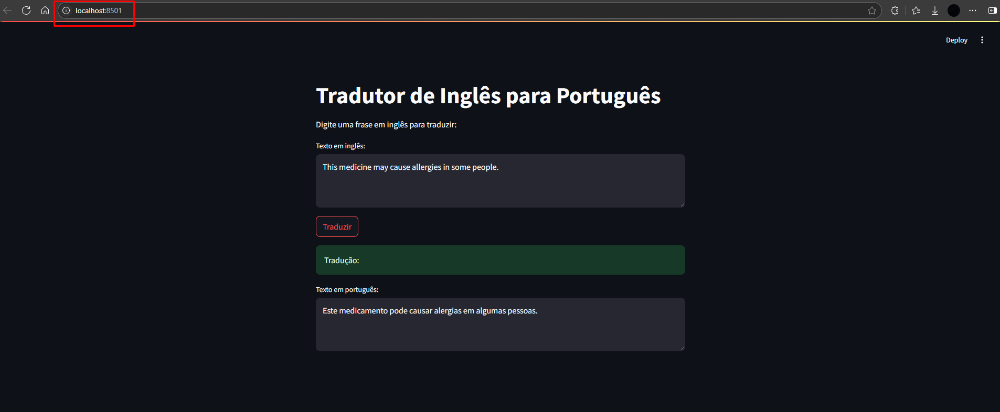

# Projeto Semestral de Inteligência Artificial

Este repositório contém um projeto de tradução automática de inglês para português, utilizando o modelo **MarianMT** da Hugging Face.

## Código completo e executável em um notebook Python

👉 [Acesse o notebook aqui](Projeto_IA.ipynb)

##  Aplicação Streamlit
Para consumir o modelo via uma aplicação Streamlit, siga os passos:

### 1. Clone o repositório

```bash
git clone https://github.com/erikhsu08/projetoIA.git
cd projetoIA
```

### 2. Instale as dependências

```bash
pip install streamlit transformers torch sentencepiece protobuf numpy pillow
```

### 3. Execute a aplicação Streamlit

```bash
streamlit run app.py
```

### 4. Acesse a aplicação

Após executar o comando acima, o Streamlit abrirá automaticamente seu navegador padrão. Caso isso não aconteça, acesse manualmente:

```
http://localhost:8501
```

### 5. Resultado esperado
Segue uma printscreen da aplicação Streamlit que deverá ser exibida para consumo do modelo desenvolvido:



## Texto / Artigo do Projeto

## Vídeo de Apresentação
- inserir link aqui
